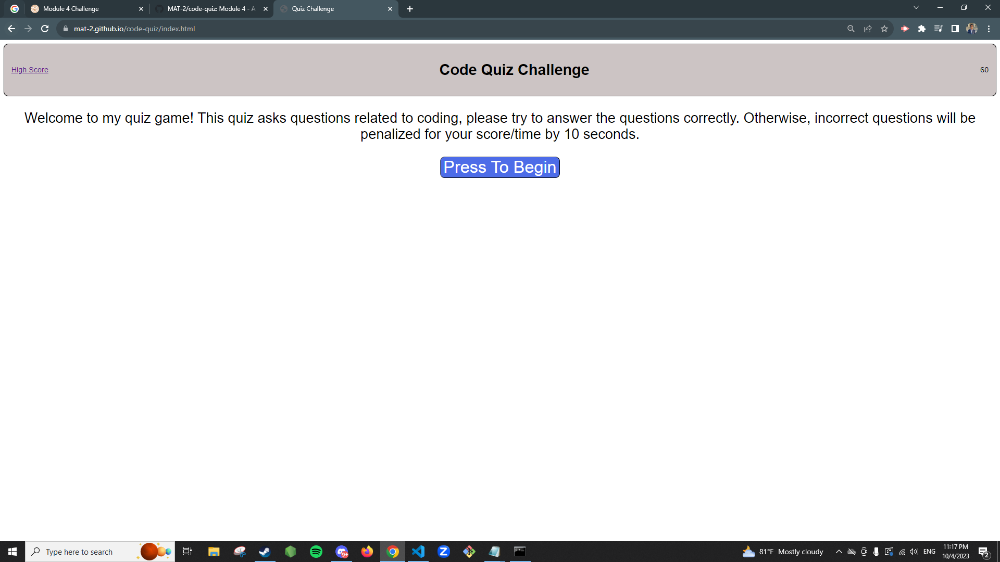
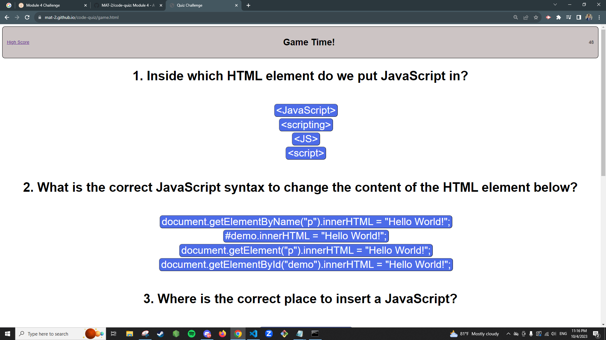
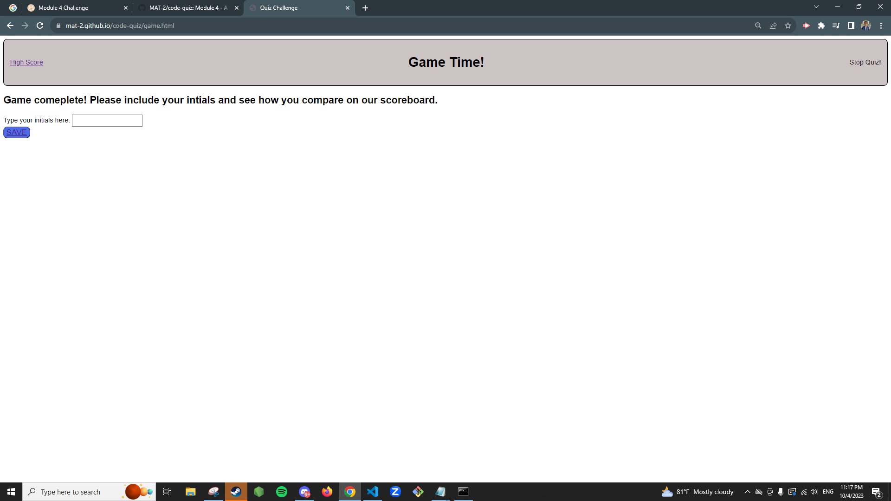

# code-quiz

Module 4 - A dynamically created project using HTML, CSS, and JS to create a quiz application.

## License

Refer to LICENSE

## Installation

N/A

## References

- https://stackoverflow.com/questions/19364836/how-to-center-ordered-list-number-in-html
- https://www.w3schools.com/js/js_quiz.asp
- https://www.freecodecamp.org/news/html-symbols-html-icon-and-entity-code-list/#:~:text=For%20example%2C%20%3E%20for%20the,by%20a%20semicolon%20(%20%3B%20).
- https://www.w3schools.com/css/css3_flexbox_container.asp#flex-direction
- https://www.w3schools.com/css/css3_buttons.asp
- https://www.w3schools.com/html/html_forms.asp
- https://www.w3schools.com/cssref/pr_class_cursor.php
- https://stackoverflow.com/questions/8919682/remove-all-styling-formatting-from-hyperlinks
- https://www.w3schools.com/jsref/prop_style_display.asp
- https://htmlcolorcodes.com/
- https://kes3583.medium.com/how-to-append-array-of-elements-to-a-dom-fa4118a0d77f

## Screenshots

